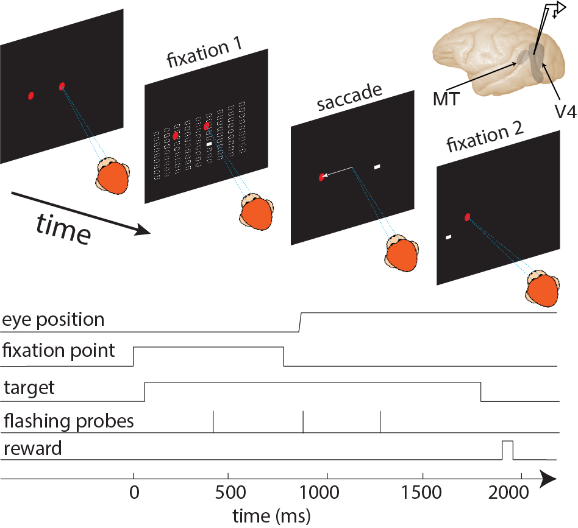
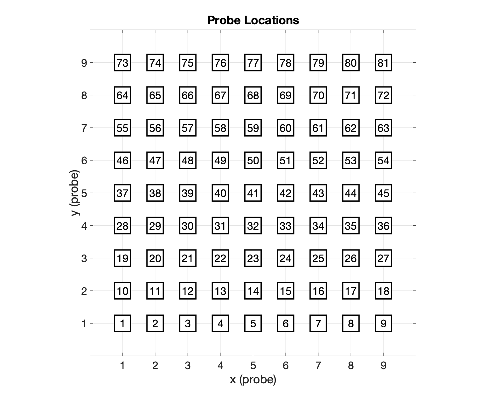
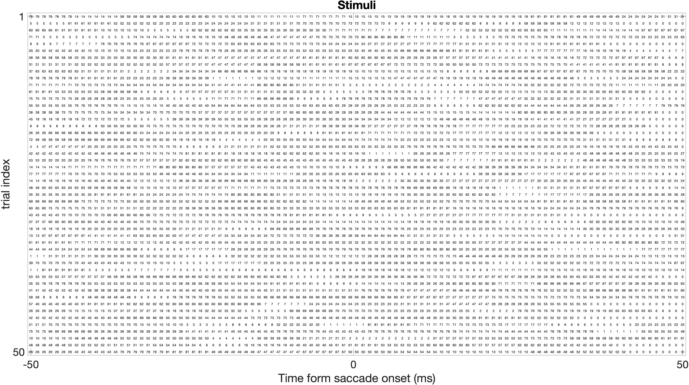
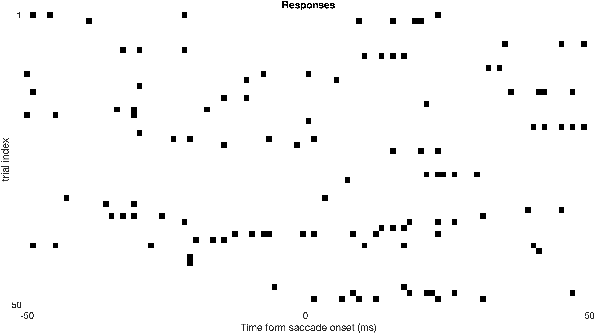

# Visualize Pre-Saccadic Effect using Sparse Variable Generalized Linear Model
> 

The sparse variable generalized linear model framework, termed the `SVGLM`, which is able to track the saccade-induced rapid changes occurring in the spatiotemporal sensitivity of the neurons on a millisecond timescale. The principal idea of the `SVGLM` is that the stimulus-response relationship in a neuron is characterized by a set of time-varying stimulus kernels, which represent the spatiotemporal receptive field of the neuron as varying along the time dimension.

## Experiment
### Paradigm

### Grid

### Stimulus

### Behavior

### Eye trace

## Stimuli and Responses

## References
[1] Niknam, K., Akbarian, A., Clark, K., Zamani, Y., Noudoost, B., & Nategh, N. (2019). Characterizing and dissociating multiple time-varying modulatory computations influencing neuronal activity. PLoS computational biology, 15(9), e1007275. [View Article](https://journals.plos.org/ploscompbiol/article?id=10.1371/journal.pcbi.1007275)
